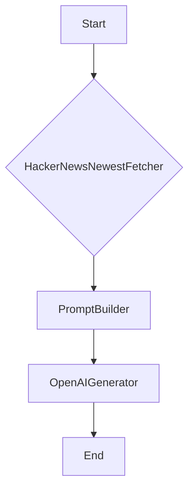

# Hacker News Summarizer CLI

A command-line interface tool to fetch the newest stories from Hacker News, extract article content, and generate concise one-sentence summaries using Haystack 2.x and OpenAI.

## Features

- Fetches the latest K stories from Hacker News.
- Asynchronously downloads and extracts clean article text using `trafilatura`.
- Utilizes Haystack 2.x for building robust LLM pipelines.
- Generates concise one-sentence summaries with `OpenAIGenerator`.
- Supports various command-line options for customization (`--last-k`, `--model`, `--temperature`, `--verbose`, `--json`).
- Gracefully handles missing URLs, 404s, paywalls, and parsing failures.
- Outputs beautifully formatted summaries or machine-readable JSON.

## Project Structure

```
project/
├── requirements.txt
├── .env.example
├── README.md
├── main.py
├── pipeline.py
├── components/
│   └── hn_fetcher.py
└── prompts/
    └── hn_summary.j2
```

## Installation

1. **Clone the repository:**
   ```bash
   git clone https://github.com/fsystemweb/hacker-news-summarizer.git
   cd hacker-news-summarizer
   ```

2. **Create a virtual environment (recommended):**
   ```bash
   python -m venv .venv
   source .venv/bin/activate
   ```

3. **Install dependencies:**
   ```bash
   pip install -r requirements.txt
   ```

4. **Set up your OpenAI API Key:**
   Copy the `.env.example` file to `.env` and replace `YOUR_OPENAI_API_KEY_HERE` with your actual OpenAI API key.

   ```bash
   cp .env.example .env
   ```
   Edit `.env`:
   ```
   OPENAI_API_KEY="sk-..."
   ```

## Usage

Run the CLI tool from your terminal:

```bash
python main.py --help
```

### Examples

**Get summaries for the last 5 stories (default):**
```bash
python main.py
```

**Get summaries for the last 10 stories:**
```bash
python main.py --last-k 10
```

**Use a different OpenAI model and temperature:**
```bash
python main.py --last-k 3 --model "gpt-4o-mini" --temperature 0.7
```

**Enable verbose output (shows skipped articles and errors):**
```bash
python main.py --verbose
```

**Output summaries in JSON format:**
```bash
python main.py --last-k 2 --json
```

## Architecture

The tool is built with a Haystack 2.x pipeline that orchestrates the following components:

1.  **`HackerNewsNewestFetcher` (custom component):** Fetches the latest stories from the Hacker News Firebase API, asynchronously downloads and extracts article text, and creates Haystack `Document` objects.
2.  **`PromptBuilder`:** Prepares the prompt for the LLM using a Jinja2 template and the fetched document content and metadata.
3.  **`OpenAIGenerator`:** Interacts with the OpenAI API to generate one-sentence summaries based on the provided prompt.

### Pipeline Diagram (Conceptual)



## Development

### Custom Components

The `components/hn_fetcher.py` file contains the custom Haystack component `HackerNewsNewestFetcher`. This component is responsible for:
- Making asynchronous HTTP requests to the Hacker News API.
- Using `trafilatura` to extract main article content from URLs.
- Handling various edge cases like missing URLs, HTTP errors, and parsing issues.
- Creating Haystack `Document` objects with rich metadata.

### Prompting

The `prompts/hn_summary.j2` file defines the Jinja2 template used by `PromptBuilder` to instruct the OpenAI model. The template ensures that the model generates exactly one concise, neutral, and informative sentence summary per post, incorporating relevant Hacker News metadata.

## Contributing

Feel free to open issues or pull requests.

## License

This project is open source and available under the [MIT License](LICENSE).
